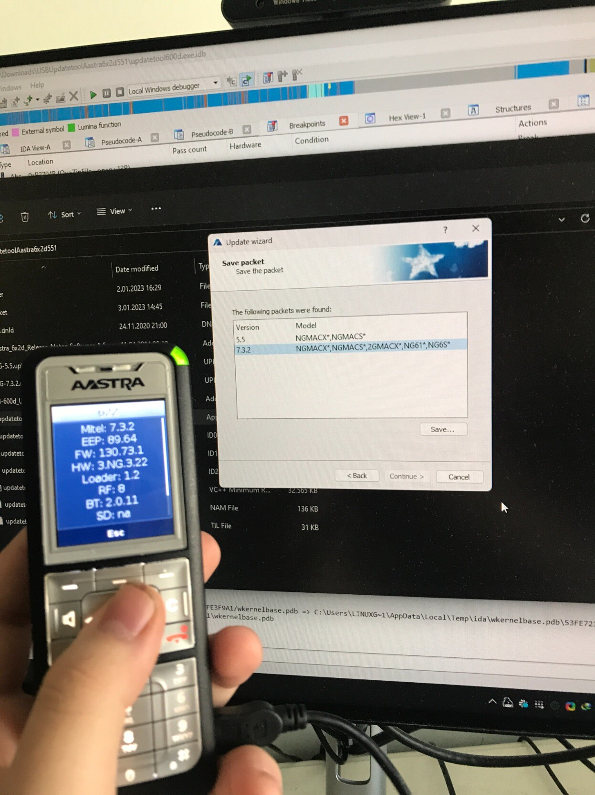

# le mitel firmware tools

tools that i made to automate the manual labor i did to make updates to my dect phone without having an entire dect rfp setup

## requirements

  - an _unencrypted_ version of the handset firmware bundle, usually named `600.dnld`.
    * if you already have a SIP-DECT setup, it should be at `/opt/SIP-DECT/600.dnld`.
    * if you don't have SIP-DECT, download the very latest of SIP-DECT 7 or 8 at https://www.mitel.com/open-solutions/system-files.
      - don't use the ova links.
      - if you get a "software export restriction" error, figure out a way to change your location and try again.
      - when you extract the zip, rename `SIP-DECT.bin` to `SIP-DECT.zip` and extract it.
        * extract the `.rpm` file with the name starting `SIP-DECT-HANDSET`.
          - the `.dnld` file should be in there somewhere, idk.
  - python 3.7 or above; i've written all this in 3.10.
  - [`zipencrypt`](https://pypi.org/project/zipencrypt/) package for python. `pip3 install -r requirements.txt` would also work.